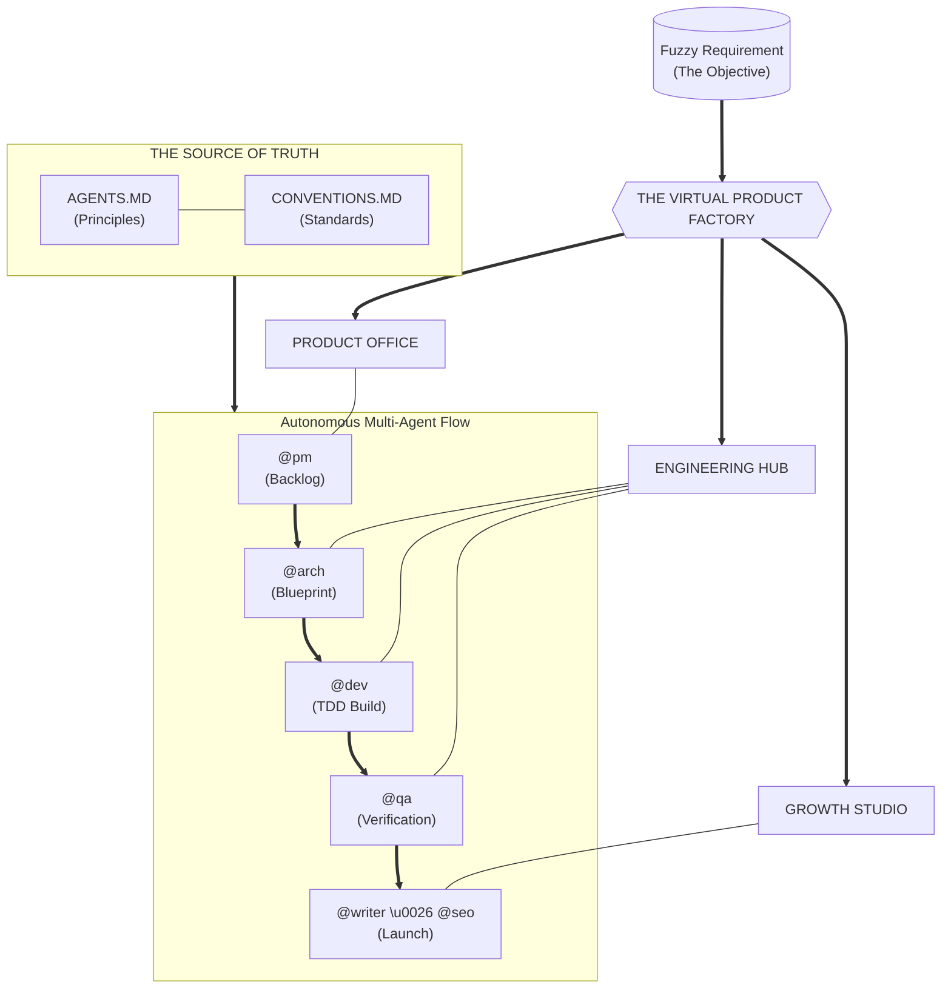
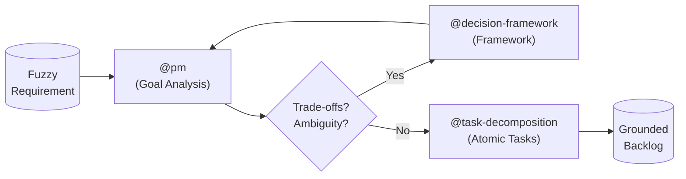
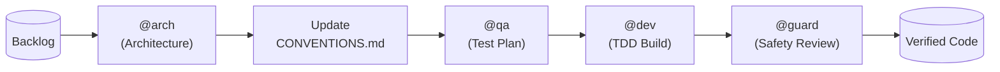
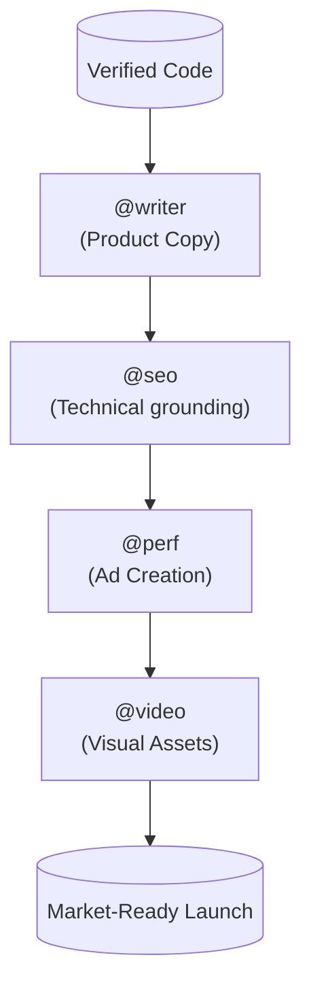

# The Virtual Product Factory

**Build at the Speed of Decision.**

This library transforms autonomous agents (Cursor, Windsurf, Claude Code, Aider, etc.) into a **simulated, high-performing product department**. It turns raw requirements into launched products by grounding agents in a rigorous, end-to-end lifecycle.

---

## 🏗️ The Factory Map

Your project's high-level strategy is governed by **[AGENTS.md](AGENTS.md)** (Principles), while execution standards are grounded in **[CONVENTIONS.md](CONVENTIONS.md)**.



---

## ⚡ Operational Playbooks

The Factory provides specific "Methods" to handle the most common product challenges.

### 1. The Fuzzy Start (Ideation ➔ Backlog)
*Handles: Vague requests, feature "asks," and undefined scope.*

When you have a loose idea, the **Product Office** takes the lead to ground it in reality.



### 2. Architectural Rigor (Blueprint ➔ TDD)
*Handles: New features, system upgrades, and critical refactors.*

Once scoped, the **Engineering Hub** simulates a senior architectural review before building.



### 3. The Growth Engine (Code ➔ Market)
*Handles: Content marketing, SEO, and Go-To-Market assets.*

Software isn't "done" until it's discoverable. The **Growth Studio** handles the launch.



---

## 🦾 Autonomous Execution

Chain these skills together to run simulation cycles:

- **Full Feature Cycle**: `@pm → @arch → @dev → @qa`
- **Rapid Maintenance**: `@debugging → @dev → @guard`
- **Launch Campaign**: `@writer → @seo → @video`

---

## 🤖 Universal Compatibility

This is a **grounding layer** for any autonomous agent:
*   **Cursor**: Reference as `.cursor/rules.md`.
*   **Windsurf**: Integrate via `.windsurfrules`.
*   **Claude Code**: Symlink to `claude.md`.
*   **Aider**: Pass as read-only context.

---

## 🚀 Setup

Reference **[CONVENTIONS.md](CONVENTIONS.md)** to ground the factory in your specific standards.

```bash
# Initialize the Virtual Product Factory
curl -sSL https://raw.githubusercontent.com/vshrinath/ai-core-skills/main/setup.sh | bash
```

---

MIT License • 2026 AI Core Skills
